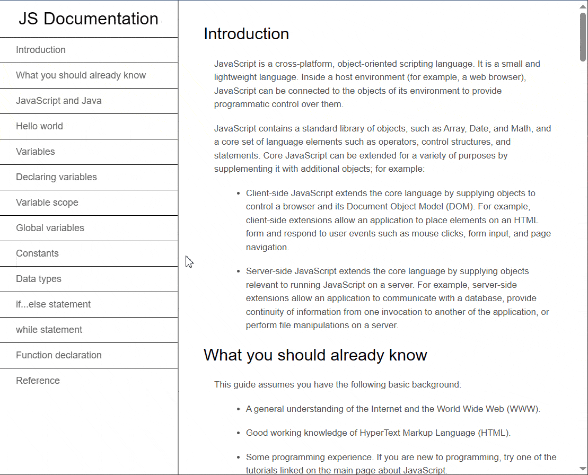

# Documentation Layout – Classic, Responsive, Elegant 🗂️
A simple, single-page documentation website built with **pure HTML and CSS** — and proud of it. 
Designed with timeless elegance, this layout combines functionality with aesthetics.

## Live Demo🚀
[Click here to view the live demo](https://documentation-layout.vercel.app/)

## Preview


## Features

- **Sidebar Navigation**  
  A fixed navigation bar sits on the **left side**, featuring bold hover interactions.  
  Click any section title, and the page will **smoothly scroll** to that section.

- **Classic Design**  
  Warm gray-beige background, clean typography, and timeless layout principles.

- **Fully Responsive**  
  On smaller screens, the navigation bar **moves to the top** and remains **scrollable** — ensuring a smooth experience across devices.

- **Pure HTML + CSS**  
  No frameworks, no JavaScript. Just hand-coded structure and style — **lightweight and fast**.
  
## Getting Started
   No build tools. No setup hell.
1. **Clone the repo**  
   ```bash
   git clone https://github.com/ivanajeo/documentation-layout.git
   cd documentation-layout
   ```
2. **Open** `index.html` **in your browser** <br />

## License
MIT📜 — feel free to use, remix, and share.

## About This Project
This project is part of freeCodeCamp curriculum challenge. <br />
It was built to practice responsive layout techniques, semantic HTML structure, and modern styling using only HTML and CSS.
